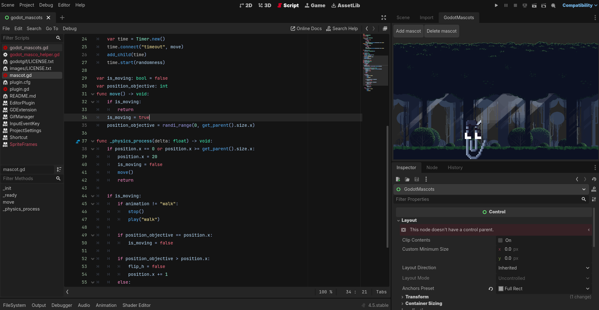

# Godot Mascots!

A silly implementation of vscode-pets for godot 

feel free to contribute, currently, we only supports left-right bars and just
a chickeen and clippy from the original repository, check assets/images for 
its license and it's pretty much it :D

yet, don't forget to give me a star :D (and here too https://github.com/tonybaloney/vscode-pets)

# NOTE

this plugin require 'godotgif' as dependency in order to use premade mascots (which are mostly in .gif format, and Godot doesn't support it)
